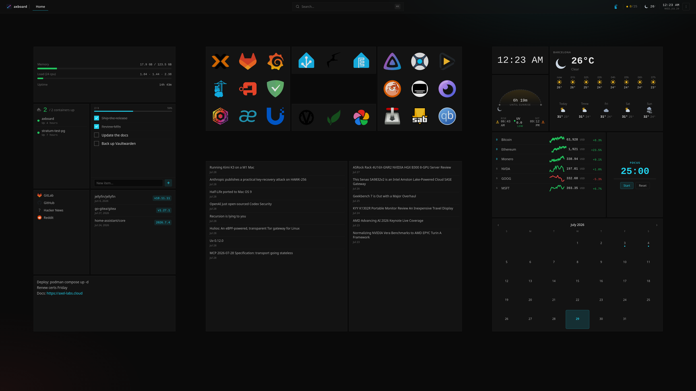

<div align="center">

# axboard

**The front door to your homelab — a fast, self-hosted dashboard for every service you run.**

Drag-and-drop widgets, health-checked app cards, alerts, public status pages, and deep theming — all from a single Go binary with an embedded React app and a hand-editable YAML config. No database, no accounts, no build step to configure.

</div>

<div align="center">
  
</div>

---

## Highlights

- **One binary.** Go server + embedded SPA. Drop it on a box, point it at a YAML file, done.
- **YAML you own.** Config is a human file the server only reads; layouts live separately, so dragging widgets never touches your comments.
- **Live monitors.** HTTP / TCP / ping / DNS + push heartbeats, with 24h/7d/30d uptime, retries, and cert-expiry checks.
- **Alerts & status pages.** Down/recover notifications (ntfy / Telegram / email / webhook) and themeable public status pages with criticality-aware severity.
- **Genuinely themeable.** 13 themes, a custom-theme creator, per-dashboard backgrounds, glass widget styling, and a custom-CSS box.
- **Keyboard-first & installable.** A ⌘K command palette, a `?` cheat sheet, and a PWA that works offline.

## Quick start

Nothing to build — pull the published image, add a compose file, create your config, and bring it up. A minimal `docker-compose.yml`:

```yaml
services:
  axboard:
    image: axboard/axboard:latest      # multi-arch (amd64/arm64); pin :v0.2.0 in prod
    container_name: axboard
    restart: unless-stopped
    network_mode: host                 # real host metrics + Wake-on-LAN; or use ports: ["8080:8080"]
    volumes:
      - ./config:/etc/axboard:Z
      - axboard-state:/var/lib/axboard:Z
volumes:
  axboard-state:
```

```sh
mkdir -p config && cp config.example.yaml config/config.yaml   # or write your own
docker compose up -d      # or: podman compose up -d
```

Open **http://localhost:8080** and edit `config/config.yaml` — the server hot-reloads on save. The bundled [`config.example.yaml`](./config.example.yaml) is a full, working starter.

> Want the deeper system widgets (host processes, filesystems, auto-discovery)? Use the fully-annotated [`docker-compose.example.yml`](./docker-compose.example.yml) — every host-access grant is optional and labelled with what it unlocks.

**From source:** `make build` (Go 1.26 + Node 22), then `./bin/axboard --config ./config.yaml --state ./state.yaml`.

## Configuration in 30 seconds

Two files: **`config.yaml`** is yours (apps, groups, dashboards, widgets — hand-edited, hot-reloaded); **`state.yaml`** is machine-owned (grid layouts, never edit). A minimal service:

```yaml
apps:
  - id: jellyfin
    name: Jellyfin
    url: https://jellyfin.lan
    icon: jellyfin
    group: media
    health: { type: http, url: https://jellyfin.lan/health, interval: 60s }
```

## Documentation

**→ [Full documentation](docs/docs.html)** — configuration, health checks & monitors, widgets, alerts, status pages, authentication, appearance, and deployment.

A few pointers:

- **Auth** — open by default (LAN-bound, meant to sit behind a proxy). Opt into a built-in argon2id login with `axboard passwd` + a `server.auth` block; see the docs.
- **Status pages** — served at `/status` and `/status/<slug>`, configured from **⋯ → Configure → Status pages**.
- **Deployment** — pull the multi-arch image, drop in [`docker-compose.example.yml`](./docker-compose.example.yml), create `config/`, and `docker compose up -d`. Update with `docker compose pull && docker compose up -d`.

## Development

```sh
make dev-go     # Go API on :8080
make dev-web    # Vite dev server on :5173, proxies /api/* → :8080 (HMR)
```

`make build` bundles the SPA into `web/dist` (embedded via `//go:embed`) and compiles the binary. `go test ./...` runs the suite.

**Stack:** Go 1.26 · chi · yaml.v3 · fsnotify — React 19 · Vite · TypeScript · Tailwind 4 · TanStack Query · react-grid-layout.

## What axboard is *not*

Not a metrics collector (health checks are liveness only — point at Grafana), not a plugin platform, not multi-tenant. Keeping it small is the point. See [CLAUDE.md](./CLAUDE.md) for the full design rationale.

## License

MIT.
