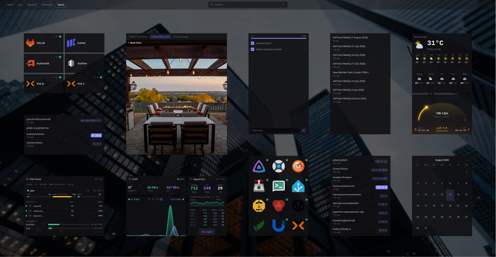

<div align="center">

# axboard

[](https://github.com/axel-labs-cloud/axboard/tags)
[](https://github.com/axel-labs-cloud/axboard/pkgs/container/axboard)
[](https://github.com/axel-labs-cloud/axboard/pkgs/container/axboard)
[](LICENSE)

**The front door to your homelab — a fast, self-hosted dashboard for every service you run.**

Drag-and-drop widgets, health-checked app cards, alerts, public status pages, and per-dashboard theming — all from a single Go binary with an embedded React app. **Set it all up by clicking** — no database, no accounts, and no config files to write unless you want to (the YAML's there if you do).

**[Website](https://axel-labs-cloud.github.io/axboard/)** · **[Documentation](https://axel-labs-cloud.github.io/axboard/docs.html)** · MIT licensed · multi-arch (amd64/arm64)

</div>

<div align="center">
  
</div>

---

## Highlights

- **One binary.** Go server + embedded SPA. Drop it on a box, open it in the browser, done.
- **80+ widgets, six categories.** Service panels (Proxmox, Sonarr/Radarr, Jellyfin/Plex, Immich, qBittorrent, Portainer, Paperless, Nextcloud…), a full **Home Assistant** suite (lights, fans, covers, climate, scenes, sensors, power, presence, locks, media, vacuum), host metrics, content feeds (Reddit, Hacker News, YouTube, RSS), and a **custom-API / template builder** for anything else. Most re-layout as you resize them.
- **Click, don't config.** Add services, build dashboards, and wire up alerts, status pages and themes from in-app panels — no file needed. Prefer text? Hand-edit the YAML; both stay in sync, and layouts live separately so dragging never touches your comments.
- **Live monitors.** HTTP / TCP / ping / DNS + push heartbeats, with 24h/7d/30d uptime, retries, and cert-expiry checks.
- **Alerts & status pages.** Down/recover notifications (ntfy / Telegram / email / webhook) and themeable public status pages with criticality-aware severity.
- **Genuinely themeable.** 13 themes plus a custom-theme creator — and **every dashboard keeps its own theme**, accent, background and density, so a cozy home board and a dense ops board live one tab apart. Glass widget styling and a custom-CSS box too.
- **Keyboard-first & installable.** A ⌘K command palette, a `?` cheat sheet, and a PWA that works offline.

## Quick start

Nothing to build — pull the published image, add a compose file, create your config, and bring it up. The bare minimum ([`docker-compose.min.yml`](./docker-compose.min.yml)):

```yaml
services:
  axboard:
    image: ghcr.io/axel-labs-cloud/axboard:latest      # multi-arch (amd64/arm64); pin :v0.2.0 in prod
    container_name: axboard
    restart: unless-stopped
    ports:
      - "8080:8080"
    volumes:
      - ./config:/etc/axboard:Z
      - axboard-state:/var/lib/axboard:Z
volumes:
  axboard-state:
```

```sh
mkdir -p config && cp config.example.yaml config/config.yaml   # or write your own
docker compose up -d      # or: podman compose up -d
```

Open **http://localhost:8080** and edit `config/config.yaml` — the server hot-reloads on save. The bundled [`config.example.yaml`](./config.example.yaml) is a full, working starter.

> Want the deeper system widgets (real host network I/O, host processes, filesystems, Wake-on-LAN, auto-discovery)? Use the fully-annotated [`docker-compose.example.yml`](./docker-compose.example.yml) — every host-access grant is optional and labelled with what it unlocks.

**From source:** `make build` (Go 1.26 + Node 22), then `./bin/axboard --config ./config.yaml --state ./state.yaml`.

## Configuration in 30 seconds

Two files: **`config.yaml`** is yours (apps, groups, dashboards, widgets — hand-edited, hot-reloaded); **`state.yaml`** is machine-owned (grid layouts, never edit). A minimal service:

```yaml
apps:
  - id: jellyfin
    name: Jellyfin
    url: https://jellyfin.lan
    icon: jellyfin
    group: media
    health: { type: http, url: https://jellyfin.lan/health, interval: 60s }
```

## Documentation

**→ [Website](https://axel-labs-cloud.github.io/axboard/) · [Full documentation](https://axel-labs-cloud.github.io/axboard/docs.html)** — configuration, health checks & monitors, an expandable reference for **all 80+ widgets** grouped by category (Productivity · System · Services · Home Assistant · Network · External), alerts, status pages, authentication, appearance, and deployment.

A few pointers:

- **Auth** — open by default (LAN-bound, meant to sit behind a proxy). Opt into a built-in argon2id login with `axboard passwd` + a `server.auth` block; see the docs.
- **Status pages** — served at `/status` and `/status/<slug>`, configured from **⋯ → Configure → Status pages**.
- **Deployment** — pull the multi-arch image, drop in [`docker-compose.example.yml`](./docker-compose.example.yml), create `config/`, and `docker compose up -d`. Update with `docker compose pull && docker compose up -d`.

## Development

```sh
make dev-go     # Go API on :8080
make dev-web    # Vite dev server on :5173, proxies /api/* → :8080 (HMR)
```

`make build` bundles the SPA into `web/dist` (embedded via `//go:embed`) and compiles the binary. `go test ./...` runs the suite.

**Stack:** Go 1.26 · chi · yaml.v3 · fsnotify — React 19 · Vite · TypeScript · Tailwind 4 · TanStack Query · react-grid-layout.

## What axboard is *not*

Not a metrics collector (health checks are liveness only — point at Grafana), not a plugin platform, not multi-tenant. Keeping it small is the point.

## License

MIT.
